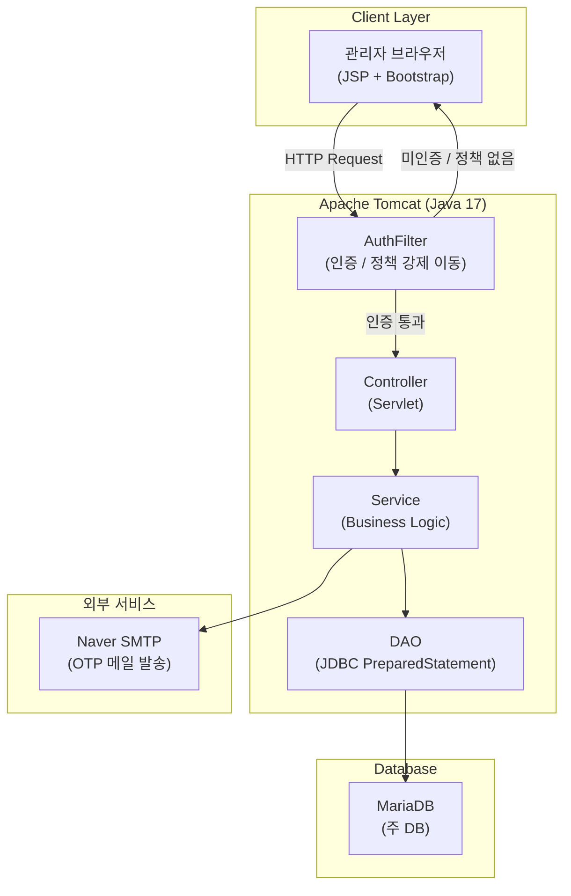
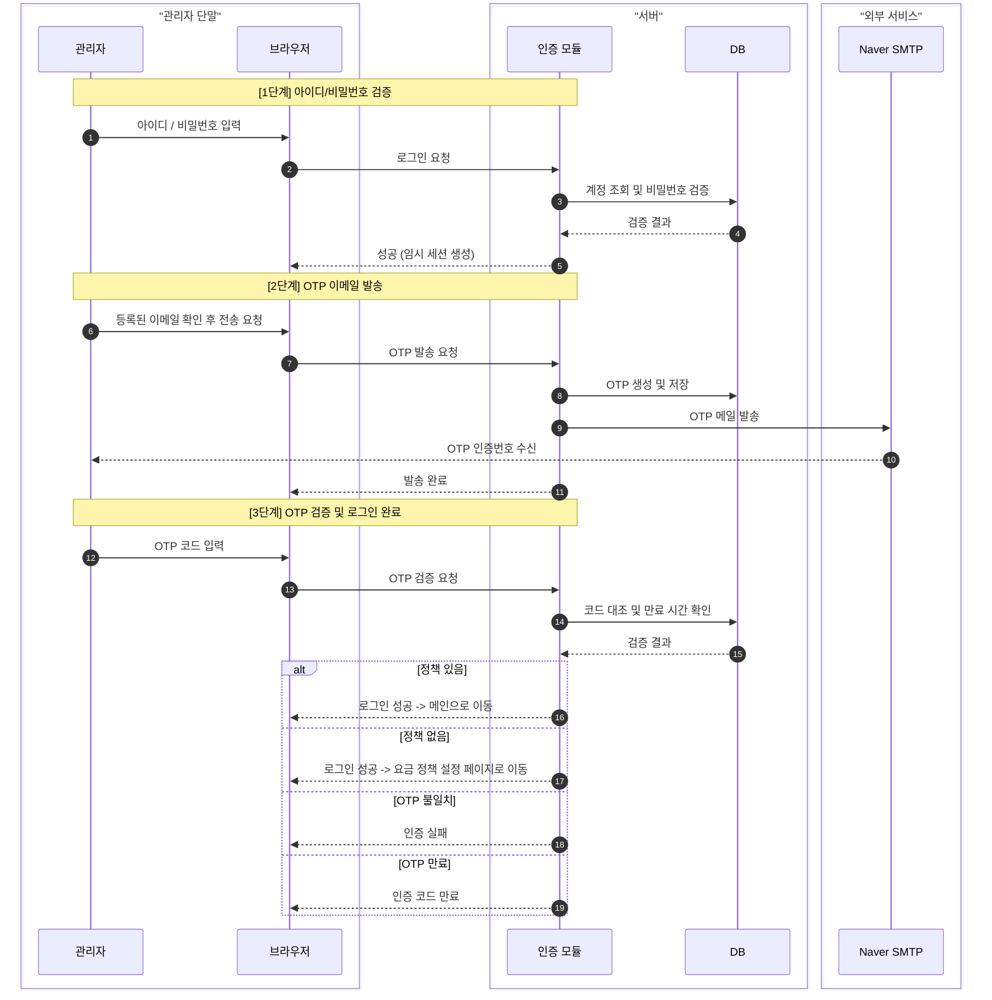
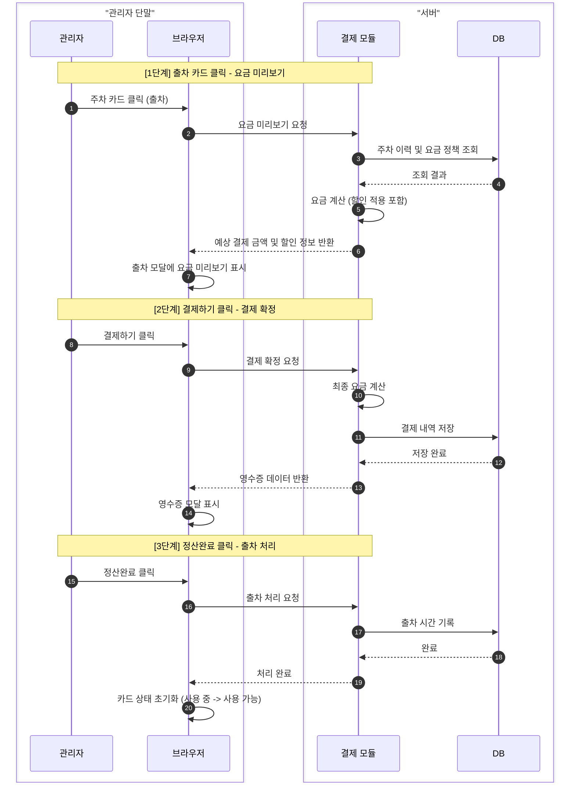

# Smart Parking System


> 주차장 관리자를 위한 웹 기반 스마트 주차 관리 시스템

---

## 목차

- [팀원 소개](#팀원-소개)
- [프로젝트 소개](#프로젝트-소개)
- [기술 의사결정](#기술-의사결정)
- [시스템 아키텍처](#시스템-아키텍처)
- [주요 기능](#주요-기능)
- [ERD](#erd)
- [시퀀스 다이어그램](#시퀀스-다이어그램)
- [기술 스택](#기술-스택)
- [환경 변수 설정](#환경-변수-설정)
- [트러블슈팅](#트러블슈팅)
- [팀 문서](#팀-문서)

---

## 팀원 소개

| 이름       | 기획                           | 백엔드                              | DB                                                  | 프론트엔드             |
|----------|------------------------------|----------------------------------|-----------------------------------------------------|-------------------|
| 손민정 (팀장) | 유스케이스, 스토리보드 (설정 관리, 통계)     | 주차 현황, 입/출차, 차량 주차 위치 검색, 회원권 결제 | parking_history                                     | 메인보드, 입출차 모달, 영수증 |
| 김준용      | 클래스 설계서, DB 구조               | 관리자 로그인, 비로그인 접근 제한              | admin                                               | 로그인, 마이페이지        |
| 박재경      | 요구사항 정의서, 스토리보드 (회원 관리)      | 회원 수정/삭제/관리, 회원권 결제              | members                                             | 회원 관리             |
| 진혜림      | 클래스 설계서, DB 구조               | 설정 관리, 요금 정산                     | payment_info, payment_history, members              | 설정 관리             |
| 조현재      | 와이어프레임, 스토리보드 (로그인, 메인 대시보드) | 매출 통계, 차량 통계, 회원 통계              | parking_history, payment_history, members, 더미데이터 생성 | 통계                |

---

## 프로젝트 소개

### 만들게 된 이유

> 이 프로젝트는 팀원 모두의 첫 번째 팀 프로젝트입니다.
> 당시 학습 중이던 Java Servlet과 JSP를 실제 서비스에 가까운 형태로 직접 구현해보며 웹의 동작 원리를 체험하는 것을 목표로 했습니다.
>
> 기존의 수기 방식으로 운영되던 소규모 주차장 관리 업무를 디지털화한다는 시나리오 하에, 입출차 현황 파악, 요금 계산, 회원권 관리, 매출 통계까지 주차장 운영에 필요한 핵심 기능을 직접 설계하고 구현했습니다.

### 프로젝트 개요

**Smart Parking System**은 Java Servlet + JSP 기반의 주차장 관리 웹 애플리케이션입니다.

> 관리자는 주차 구역별 입출차 등록부터 요금 정산, 회원권 관리, 매출 통계 조회까지 하나의 시스템에서 처리할 수 있습니다.
> 이메일 OTP 2단계 인증, 쿠키 기반 자동 로그인, 요금 정책 미설정 시 강제 플로우, 자정을 넘긴 장기 주차 요금 처리 등 실제 운영 환경을 고려한 기능을 포함합니다.

- 개발 기간: 2025.02 ~ 2025.03
- 팀 구성: 5인

---

## 기술 의사결정

### Java Servlet / JSP

> 당시 팀원 전원이 학습 중이던 기술이었고, 첫 프로젝트인 만큼 Spring 같은 프레임워크 없이 Servlet과 JSP만으로 구현하며 HTTP 요청 처리, 필터 동작, 세션 관리 등 웹의 기본 동작 원리를 직접 경험하는 것을 우선했습니다.

### MariaDB

> MySQL과 호환성이 높고 오픈소스 기반으로 학습 환경에서 접근하기 쉬우며, 팀원 모두 사용 경험이 있어 선택했습니다.

### HikariCP

> 매 요청마다 DB 커넥션을 새로 생성하면 성능 저하와 자원 낭비가 발생합니다. HikariCP는 Java 진영에서 가장 널리 사용되는 커넥션 풀 라이브러리로, 설정이 간단하고 성능이 검증되어 있어 선택했습니다.

### jBCrypt

> 관리자 비밀번호를 평문으로 저장하면 DB 노출 시 보안 문제가 발생합니다. BCrypt는 단방향 해시로 복호화가 불가능하며, 솔트를 자동 적용해 동일한 비밀번호도 매번 다른 해시값이 나와 안전합니다.

### Jakarta Mail

> OTP 인증 코드를 이메일로 전송하기 위해 사용했습니다. Jakarta EE 표준 메일 API로 Servlet 환경과 자연스럽게 통합됩니다.

### Bootstrap 5.3.2

> 팀 프로젝트 특성상 팀원마다 CSS를 따로 작성하면 페이지별 디자인이 달라지는 문제가 생깁니다. Bootstrap을 공통 기준으로 삼아 UI 컴포넌트를 통일하고 개발 속도를 높였습니다.

---

## 시스템 아키텍처



## 주요 기능

### 인증

- 아이디/비밀번호 로그인 (BCrypt 암호화)
- 이메일 OTP 2단계 인증 (Naver SMTP)
- Remember-me 자동 로그인 (쿠키 기반)
- 비밀번호 / 이메일 변경 (마이페이지)

### 메인보드 (입출차 관리)

- 주차 구역(A1 ~ A20) 실시간 현황 카드
- 차량 입차 등록 (차량번호, 차종 선택)
- 출차 시 Java 서버에서 계산한 요금 미리보기
- 결제 후 영수증 표시, 정산완료 시 출차 처리

### 요금 정책 설정

- 무료 회차 시간, 기본 요금/시간, 초과 요금/시간, 일일 최대 요금 설정
- 자정을 넘긴 장기 주차 요금 날짜별 cap 처리
- 차종별 할인 (경차, 장애인), 월정액 회원 100% 할인 처리
- 정책 미설정 시 로그인 후 설정 페이지 강제 이동 (AuthFilter 연동)

### 회원권 관리

- 회원권 등록/수정 (차량번호, 기간, 회원권 요금)
- 페이징 + 만료 여부 정렬 (유효 회원 우선, 동일 만료일 시 이름순)
- 회원권 중복 차량번호 체크

### 통계

- 오늘 매출, 입차 수, 누적 입차 수 요약 카드
- 월별/일별 매출 차트, 누적 매출 차트 (회원권 매출 포함/제외 전환)
- 차종별 비율 파이 차트
- 시간대별 피크 시간 차트

---

## ERD


---

## 시퀀스 다이어그램

### 로그인 흐름 (OTP 인증)



### 출차 및 요금 정산 흐름



---

## 기술 스택

**Backend**

| 항목                  | 내용                                        |
|---------------------|-------------------------------------------|
| Language            | Java 17                                   |
| Runtime             | Jakarta EE 6.0 (Servlet API 6.0.0)        |
| Build               | Gradle                                    |
| Server              | Apache Tomcat                             |
| Database            | MariaDB                                   |
| JDBC Driver         | mariadb-java-client 3.5.3                 |
| Connection Pool     | HikariCP 5.0.1                            |
| Object Mapping      | ModelMapper 3.1.1                         |
| Logging             | Log4j2 2.25.3 + SLF4J 2.0.7               |
| Password Encryption | jBCrypt 0.4                               |
| Mail                | Jakarta Mail API 2.1.3 (Angus Mail 2.0.4) |
| JSON                | Jackson 2.15.2                            |
| Lombok              | 1.18.30                                   |

**Frontend**

| 항목            | 내용              |
|---------------|-----------------|
| View          | JSP             |
| CSS Framework | Bootstrap 5.3.2 |
| HTTP Client   | Axios           |
| Font          | Pretendard      |

---

## 환경 변수 설정

### 사전 요구사항

- JDK 17 이상
- MariaDB 10.6 이상
- Apache Tomcat 10.x (Jakarta EE 10 지원 버전)
- IntelliJ IDEA (권장)

### 1. 데이터베이스 설정

MariaDB에 접속해 데이터베이스와 사용자를 생성합니다.

```mariadb
CREATE DATABASE smart_parking_system CHARACTER SET utf8mb4 COLLATE utf8mb4_unicode_ci;

CREATE USER 'system_user'@'localhost' IDENTIFIED BY '비밀번호';
GRANT ALL PRIVILEGES ON smart_parking_system.* TO 'system_user'@'localhost';
FLUSH PRIVILEGES;
```

### 2. DB 연결 정보 수정

`src/main/java/com/example/parkingsystem/util/ConnectionUtil.java` 파일에서 접속 정보를 수정합니다.

```java
config.setJdbcUrl("jdbc:mariadb://localhost:3306/smart_parking_system");
config.setUsername("system_user");
config.setPassword("본인 비밀번호");
```

### 3. 메일 발송 설정

`src/main/resources/mail.properties.example`을 복사해 `mail.properties`를 생성한 뒤 발신 계정 정보를 입력합니다.

```properties
mail.host=smtp.naver.com
mail.port=587
mail.smtp.auth=true
mail.smtp.starttls.enable=true
mail.userName=your_email@naver.com 
mail.password=your_app_password
```

네이버 메일 설정에서 SMTP 사용을 활성화하고, 네이버 계정의 2단계 인증이 설정된 경우 앱 비밀번호를 발급해 사용합니다.
`mail.properties`는 `.gitignore`에 등록되어 있어 저장소에 업로드되지 않습니다.

### 4. 초기 데이터 설정

프로젝트 최초 실행 시 아래 순서대로 진행합니다.

```
1. java > DB > initDB 실행
2. 테이블에 이전 데이터가 존재할 경우
   java > initDBData > deletePrevious.sql 전체 실행
3. java > initDBData > initData.sql 실행
4. Tomcat 서버 실행
```

### 5. 기본 로그인 정보

```
id     : admin
passwd : 1234
e-mail : (mail.properties에 등록한 이메일)
```

> OTP 인증이 필요하므로 반드시 `mail.properties`에 실제 이메일을 등록해야 합니다.

---

**패키지 구조**

```
com.example.parkingsystem
├── controller      # 요청 수신 및 응답 반환 (Servlet)
│   ├── auth        # 로그인, OTP 인증, 자동 로그인
│   ├── main        # 입출차, 결제
│   ├── member      # 회원권 CRUD
│   ├── mypage      # 관리자 마이페이지 (비밀번호/이메일 변경)
│   ├── setting     # 요금 정책 설정
│   └── statistic   # 통계 조회
├── service         # 비즈니스 로직 (요금 계산, 통계 집계 등)
├── dao             # DB 접근 (JDBC PreparedStatement)
├── dto             # Controller ↔ Service 데이터 전달
├── vo              # Service ↔ DAO 데이터 전달
├── filter          # 인증 필터 (AuthFilter)
└── util            # DB 연결 (HikariCP), ModelMapper
```

---

## 트러블슈팅

### 1. 무료 회차 시간 0 설정 시 요금 계산 오류

**문제**

> 무료 회차 시간을 0분으로 설정하면 0분과 1분 주차가 동일하게 처리되어 무료 회차 설정이 사실상 무의미해지는 문제가 발생했습니다.

**원인**

> 분(minute) 단위로 계산하면 1분 미만의 주차 시간을 구분할 수 없어, 무료 회차를 0으로 설정해도 아주 짧은 주차에 요금이 부과되지 않는 문제가 생겼습니다.

**해결**

> 계산 단위를 초(second)로 변경했습니다. 무료 회차를 0으로 설정하면 실제 주차 시간이 1초라도 있을 경우 즉시 요금이 부과되어 설정 의도가 정확히 반영됩니다.

---

### 2. 로그인 완료 후 요금 정책이 없을 때 리다이렉트가 동작하지 않는 문제

**문제**

> 서버에서 리다이렉트 응답을 보냈는데 클라이언트에서 실제 페이지 이동이 되지 않았습니다.

**원인**

> 비동기 통신(fetch API)은 서버의 리다이렉트 응답을 브라우저 주소창 이동으로 처리하지 않고 내부적으로 처리합니다. 커스텀 응답 헤더 방식도 브라우저 보안 정책으로 인해 읽히지 않았습니다.

**해결**

> 요금 정책 미설정 상태를 별도의 HTTP 상태코드로 구분하고, 클라이언트에서 해당 상태코드를 받았을 때 직접 페이지를 이동하도록 처리했습니다. 추가로 서버 필터에서 요금 정책이 없으면 설정 페이지 외 모든 접근을 차단하는 강제 플로우를 구현했습니다.

---

### 3. 자정을 넘긴 장기 주차 요금 계산 오류

**문제**

> 24시간 이상 주차 시 일일 최대 요금 상한이 날짜별로 적용되지 않고 실제 요금보다 높거나 낮게 계산되는 문제가 발생했습니다.

**원인**

> 전체 주차 시간을 단순 나눗셈으로 날짜 수를 구한 뒤 나머지 시간에 단일 요금 공식을 적용하는 방식이었습니다. 날짜가 바뀔 때마다 각 날의 최대 요금 상한을 독립적으로 적용하지 못한 것이 원인이었습니다.

**해결**

> 자정을 기준으로 첫날, 중간 날짜, 마지막날 세 구간으로 나눠 각각 최대 요금 상한을 적용하고 합산하는 방식으로 수정했습니다.

---

### 4. 요금 계산 이중 호출로 인한 NPE 위험

**문제**

> 결제 처리 후 영수증 표시를 위해 요금을 한 번 더 계산하는 과정에서, 이미 출차 처리된 차량 정보를 다시 조회하면 데이터가 없어 NPE가 발생할 수 있는 구조였습니다.

**해결**

> 결제 처리 메서드가 계산 결과를 즉시 반환하도록 반환 타입을 변경했습니다. 이후 영수증 표시 시 동일한 결과를 재사용하여 추가 조회 없이도 처리할 수 있도록 수정했습니다.

---

### 5. 회원권 매출 통계에 미래 날짜 데이터가 포함되는 문제

**문제**

> 아직 시작되지 않은 회원권의 금액이 통계에 포함되어 실제 매출보다 높게 표시됐습니다.

**원인**

> 회원권 매출 집계 시 시작 연도와 월만 확인하고, 시작일이 오늘 이후인지 여부를 체크하지 않았습니다.

**해결**

> 오늘 이전에 시작한 회원권만 매출로 집계하도록 날짜 비교 조건을 추가했습니다.

---

## 팀 소감문

**손민정**

> 첫 프로젝트였던 만큼 우여곡절도 많았고 아는 것보다 모르는 것이 많아 시행착오를 겪는 시간이 대부분이었던 프로젝트였으나 그만큼 성장할 수 있었던 계기가 되었다. 백엔드, 프론트엔드, DB 등 다양한 기술을 활용해 내가 목표한 기능을 구현해보면서 기술 간의 연결이 어떻게 이루어지는지 이해할 수 있었다. 특히나 이 과정에서 수많은 오류를 접하면서 오류의 근원지를 찾고 해결해나가는 역량이 크게 향상되었다.
> 4명의 팀원과 공동 작업을 하면서 현업에서 실제로 어떤 식으로 프로젝트가 분업되고 공유되고 있는지 체감할 수 있었으며, 깃허브를 활용한 브랜치 관리 및 머지 과정, 또 그 과정에서 일어난 충돌을 해결하면서 체계적인 버전 관리는 물론 팀원 간 소통의 중요성을 알게 되었다. 기능 단위로 역할을 나눴기 때문에 각자의 작업이 다른 팀원의 기능과 맞닿는 지점에서 사전에 충분히 소통하지 않으면 통합 시 예상치 못한 문제가 생긴다는 것도 직접 경험했다.

---

**김준용**

> Servlet, JSP, JavaScript를 사용하여 MVC 패턴 기반으로 구축하였고 웹페이지는 BootStrap 템플릿을 기반으로 프로젝트 목적에 맞게 커스터마이징하고 기능 로직과 연동하여 구현하였습니다. 
> 관리자 계정 로그인 기능을 맡았기 때문에 보안에 중점을 두고 3단계 인증 방식을 설계하였습니다. 아이디/비밀번호 검증 -> 이메일 인증 -> OTP 검증의 순서로 진행되며, 모든 단계를 통과하면 최종 세션을 생성하고 임시 세션은 제거하도록 구현하였습니다. 
> 협업 측면에서는 데이터베이스를 팀 전체가 먼저 함께 설계하고 시작한 것이 가장 효과적이었습니다. 초기에 테이블 구조를 체계적으로 잡아둔 덕분에 이후 기능을 추가하거나 병합하는 과정에서 큰 충돌 없이 진행할 수 있었습니다. 다음 프로젝트에서도 DB 설계를 최우선으로 진행하는 방식을 유지할 계획입니다.

---

**박재경**

> 스마트 주차관리 시스템 프로젝트에서 회원 관리 기능을 전담하여 개발했습니다. 회원 등록, 회원 정보 수정, 회원권 결제 기능을 구현하며 사용자 데이터를 효율적으로 관리하는 구조를 설계하는 역할을 맡았습니다. 
> 개발 과정에서 NullPointerException 오류를 겪으며 데이터 조회 결과에 대한 null 체크와 예외 처리의 중요성을 체감했고, 이를 해결하면서 문제 분석 능력을 향상시킬 수 있었습니다. 
> 팀 협업 측면에서는 회원 테이블이 여러 팀원의 기능과 연결되는 공유 자원이었기 때문에, 스키마 변경이 필요할 때마다 팀원들과 충분히 논의하고 진행하는 과정을 통해 협업 시 명확한 소통의 중요성을 배웠습니다. 이번 프로젝트를 통해 단순한 CRUD 구현을 넘어 MVC 구조에서의 역할 분리와 계층 간 데이터 흐름을 이해하게 되었습니다.

---

**진혜림**

> 설정 관리 페이지와 요금 정산 로직을 담당하였습니다. payment_info, payment_history 테이블을 기반으로 정책 변경이 프론트엔드에서 백엔드까지 연동되는 전체 흐름을 직접 구현하면서 기술 간 연결 구조를 이해할 수 있었습니다. 
> 협업 과정에서는 요금 정책 테이블이 입출차 계산, 통계, 회원 관리 등 다른 팀원의 기능과 밀접하게 연결되어 있었기 때문에 DB 설계 단계부터 팀원들과 긴밀하게 소통하며 진행했습니다. GitHub를 활용한 브랜치 관리와 병합 과정에서 아이디어를 조율하고 수정하며 협력하는 방식을 몸소 배웠으며, 다음 프로젝트에서는 더 많은 역할을 수행할 수 있을 것 같아 기대가 됩니다.

---

**조현재**

> 주차장 관리 프로그램의 통계 기능을 담당하였습니다. 백엔드 위주로 학습하던 시기에 프론트엔드 차트 라이브러리와 복잡한 DB 집계 쿼리를 함께 다뤄야 했기 때문에 어려움이 있었으나, 직접 구조를 이해하며 하나씩 해결해 나갔습니다. 
> 통계 특성상 다른 팀원들이 생성한 데이터(parking_history, payment_history, members)를 읽어서 집계하는 구조였기 때문에, 팀원들이 각자의 기능을 안정적으로 구현해 주는 것이 제 작업의 전제 조건이 되었습니다. 이를 통해 팀 프로젝트에서 개인 작업이 결코 독립적이지 않으며, 팀원 간 신뢰와 일정 조율이 얼마나 중요한지 실감했습니다.

---

## 팀 문서

| 문서        | 링크                                                                                                         |
|-----------|------------------------------------------------------------------------------------------------------------|
| 요구사항 정의서  | [링크](https://docs.google.com/spreadsheets/d/1iHmiVPuaO9F5KZd4SGHV1pBwFwcBb6wl92UeOPcnZw/edit?usp=sharing)  |
| 테이블 정의서   | [링크](https://docs.google.com/document/d/1NBdcpwGBkzLsNOaOyBEcQb6qMM0GrEwSTqb76FuH4kI/edit?usp=sharing)     |
| 패키지 구조 정의 | [링크](https://docs.google.com/spreadsheets/d/1RH95hQf4t-xsXRr7OgITwlFmGdQ6fj9duR-wXzBGSaE/edit?usp=sharing) |
| 테스트 시트    | <!-- 링크 작성 -->                                                                                             |
| 클래스 명세서   | <!-- 링크 작성 -->                                                                                             |

---

## 라이선스

MIT License

---

<p align="center">smartparkingsystem — Built with Servlet & JSP</p>
